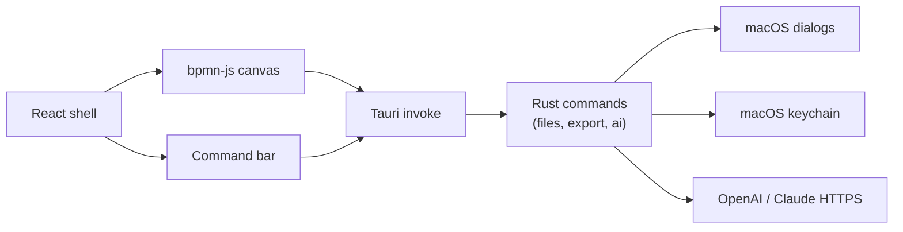

# BPMN Studio

BPMN Studio is a lightweight, open-source native BPMN 2.0 editor for macOS. It targets Apple Silicon and Intel Macs through [Tauri](https://tauri.app/) 2.

## Stack

- **UI:** React, TypeScript, Tailwind CSS
- **Diagramming:** [bpmn-js](https://bpmn.io/)
- **Shell:** Tauri 2 (Rust)

AI requests run in Rust. API keys are stored in the macOS keychain. File open, save, and export dialogs are exposed as Tauri commands from Rust.

## Keyboard shortcuts

| Shortcut | Action |
| --- | --- |
| `Cmd+O` | Open a BPMN diagram |
| `Cmd+S` | Save the current diagram |
| `Cmd+Shift+E` | Export as SVG |
| `Cmd+K` | Open the AI prompt / command bar |

## Development

Requirements:

- Node.js 22+
- Rust (stable toolchain)

```bash
npm install
npm run tauri dev
```

Checks:

```bash
npx tsc --noEmit
cargo test --manifest-path src-tauri/Cargo.toml
```

Frontend production build (TypeScript compile + Vite):

```bash
npm run build
```

## Architecture



## Releases

Pushing a `v*` tag runs `.github/workflows/release.yml`, which builds the macOS app with `tauri-apps/tauri-action` and attaches `.dmg` / `.app` artifacts to a **draft** GitHub release.

Bundling uses `src-tauri/tauri.conf.json` (`productName` **BPMN Studio**, identifier `com.bpmnstudio.mac`, targets `dmg` and `app`).

The published `.dmg` is **unsigned** unless a maintainer adds Apple signing secrets. Signing is optional and not configured in this repository. This project does not claim notarization.
